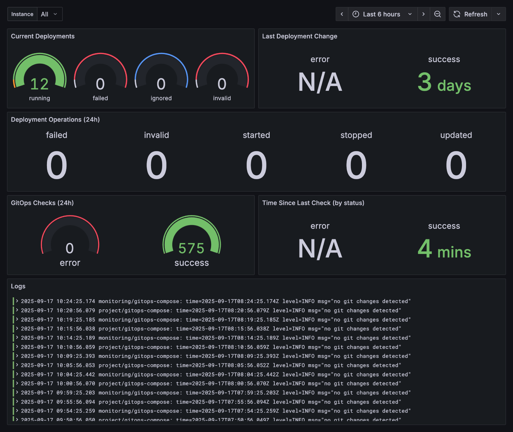

# GitopsCompose

GitopsCompose is a GitOps continuous delivery tool for single node Docker Compose deployments.

## How it works

- It repeatedly checks a local repository for remote changes
- If changes exist:
  1. Get all `docker-compose.yml` files of the local git head
  2. Get all `docker-compose.yml` files of the remote git head (stop here when something is wrong)
  3. Stop all removed compose stacks
  4. Pull changes
  5. Detect changed deployments (added or modified)
  6. Apply changes (pull images, eventually stop running stacks, start stack)

> GitopsCompose tries to exit early when errors occur (e.g. when the local repository is not clean). When it proceeds to step 3, errors are tracked but all operations continue (e.g. a failed stop of a removed deployment will not prevent other stacks to be updated).

### Limitations

- Pinned image versions are recommended. If you use `:latest`, somehow change compose.yml to trigger changes.
- Errors during the removal of a compose stack could lead to an inconsistent state (containers might still run but the compose file is removed after git pull)
- Fixed naming: GIT branch is fixed to "main". Compose files must be named `docker-compose.yml`

### HTTP server

By default GitopsCompose starts a HTTP server with `/metrics` and `/webhook` endpoints on port `:2112`. Either disable the endpoints or add authentication through a reverse proxy when the port is accessible through the internet.

## Example

Maintain a GIT repository to store all deployments on your host:

```text
.
├── my_app
│   └── production
│       └── .env
│       └── docker-compose.yml
│   └── staging
│       └── .env
│       └── docker-compose.yml
├── reverse_proxy
│   └── docker-compose.yml
├── monitoring
│   └── docker-compose.yml
├── gitops
│   └── .env
│   └── docker-compose.yml (add label gitops.controller=true)
```

### Labels

| Label             | Default | Description                                                                                                                                                            |
| ----------------- | ------- | ---------------------------------------------------------------------------------------------------------------------------------------------------------------------- |
| gitops.controller | false   | Declares a compose stack as gitops controller (will not allow start or stop operations, and tries a special restart that kills the currently running gitops container) |
| gitops.ignore     | false   | Ignores a compose stack                                                                                                                                                |

> Docker compose labels are set on a service level. However, GitopsCompose only manages whole stacks. The presence of a label will affect the whole stack (e.g. all services will be ignored when one has the ignore label)

### Environment variables

| Variable                  | Default     | Required | Description                                    |
| ------------------------- | ----------- | -------- | ---------------------------------------------- |
| CHECK_INTERVAL_IN_SECONDS | 300         | no       | -1 disables the repeated check                 |
| REPOSITORY_PATH           | /repository | no       | Container internal path for the git repository |
| REPOSITORY_USERNAME       |             | yes      |                                                |
| REPOSITORY_PASSWORD       |             | yes      |                                                |
| DOCKER_REGISTRY_URL       |             | no       |                                                |
| DOCKER_REGISTRY_USERNAME  |             | no       |                                                |
| DOCKER_REGISTRY_PASSWORD  |             | no       |                                                |
| DISABLE_WEBHOOK           | false       | no       | Disables the /webhook endpoint                 |
| DISABLE_METRICS           | false       | no       | Disables the /metrics endpoint                 |

### Configuration

gitops/docker-compose.yml

```yaml
services:
  gitops-compose:
    image: ghcr.io/korbiniankuhn/gitops-compose:0.0.1-dev.12
    container_name: gitops-compose
    restart: always
    ports:
      - 127.0.0.1:2112:2112
    user: "${UID}:${GID}"
    group_add:
      - ${GID_DOCKER}
    environment:
      REPOSITORY_USERNAME: ${GITLAB_DEPLOY_TOKEN_USERNAME}
      REPOSITORY_PASSWORD: ${GITLAB_DEPLOY_TOKEN_PASSWORD}
      DOCKER_REGISTRY_URL: registry.gitlab.com
      DOCKER_REGISTRY_USERNAME: ${GITLAB_DEPLOY_TOKEN_USERNAME}
      DOCKER_REGISTRY_PASSWORD: ${GITLAB_DEPLOY_TOKEN_PASSWORD}
    volumes:
      - /var/run/docker.sock:/var/run/docker.sock
      - ./deployments:/repository
    labels:
      - "gitops.controller=true"
```

## Monitoring

Prometheus metrics are exported under [localhost:2112/metrics](localhost:2112/metrics):

```yaml
# HELP gitops_check_timestamp_seconds Unix timestamp of the last GitOps check by status
# TYPE gitops_check_timestamp_seconds gauge
gitops_check_timestamp_seconds{status="error"} 0
gitops_check_timestamp_seconds{status="success"} 1.745999180830443e+09
# HELP gitops_check_total Total number of GitOps checks by status
# TYPE gitops_check_total counter
gitops_check_total{status="error"} 0
gitops_check_total{status="success"} 2
# HELP gitops_deployments_active_total Number of active deployments by status
# TYPE gitops_deployments_active_total gauge
gitops_deployments_active_total{status="failed"} 0
gitops_deployments_active_total{status="ignored"} 1
gitops_deployments_active_total{status="invalid"} 0
gitops_deployments_active_total{status="running"} 4
# HELP gitops_deployments_change_timestamp_seconds Unix timestamp of the last deployment change by status
# TYPE gitops_deployments_change_timestamp_seconds gauge
gitops_deployments_change_timestamp_seconds{status="error"} 0
gitops_deployments_change_timestamp_seconds{status="success"} 0
# HELP gitops_deployments_operations_total Total number of deployment operations.
# TYPE gitops_deployments_operations_total counter
gitops_deployments_operations_total{operation="failed"} 0
gitops_deployments_operations_total{operation="ignored"} 1
gitops_deployments_operations_total{operation="invalid"} 0
gitops_deployments_operations_total{operation="started"} 4
gitops_deployments_operations_total{operation="stopped"} 0
gitops_deployments_operations_total{operation="updated"} 0
```

### Grafana

A prebuilt dashboard is [here](dashboard.json).



## Credits

- [github.com/kimdre/doco-cd](github.com/kimdre/doco-cd) _GitopsCompose was inspired by doco-cd_
- [github.com/go-git/go-git](github.com/go-git/go-git)
- [github.com/docker](github.com/docker)
- [github.com/compose-spec/compose-go](github.com/compose-spec/compose-go)
